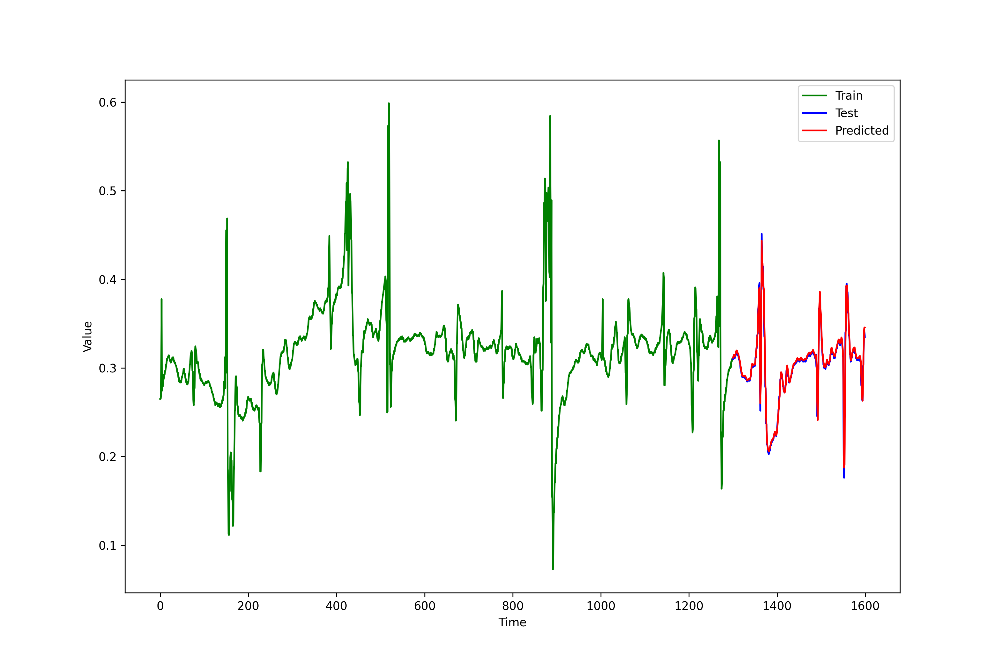
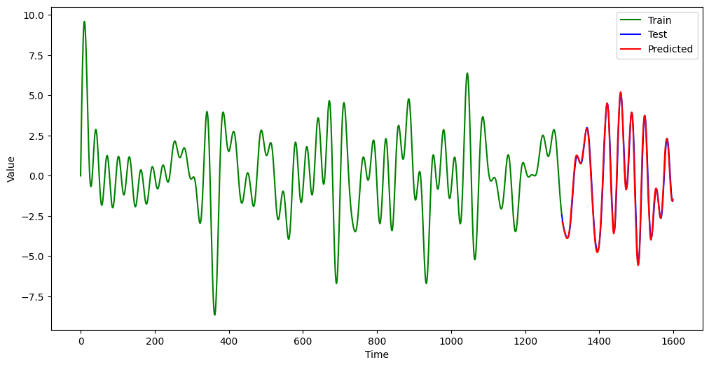

# DeepESN: Deep Echo State Network

## Overview
DeepESN is a TensorFlow-based implementation of Deep Echo State Networks (deepESN and deepESN-IA).This project explores various training techniques for these models, optimizing them for time-series data processing and prediction.

## Features
- Deep ESN architecture with customizable number of reservoirs and reservoir sizes.
- Visualize the evolution of reservoir and intermediate layer node activations over training epochs.


## Requirements

Before running the project, make sure you have the following installed:

- Python 3.8 or later
- TensorFlow 2.3.0
- NumPy
- Matplotlib

You can install the dependencies using:
```bash
pip install tensorflow numpy matplotlib
```

## Dataset
This project assumes the presence of an EMG (or MSO) dataset saved as a NumPy file (`emg.npy` or `mso.npy`) located in a `dataset/` directory. 

## Available Classes

### Core Models
- **`DeepEsn`**: Trains only the readout layer of DeepESN using gradient descent.
- **`DeepEsnIA`**: Trains only the readout layer with input to all layers (DeepESN-IA) using gradient descent.

### Advanced Models
- **`DeepEsnBptt`**: Trains readouts from reservoirs in DeepESN using Backpropagation Through Time (BPTT).
- **`DeepEsnIaBptt`**: Trains readouts from reservoirs in DeepESN-IA using BPTT.
- **`DeepEsnTarget`**: Trains readouts from reservoirs in DeepESN using intermediate targets.
- **`DeepEsnIaTarget`**: Trains readouts from reservoirs in DeepESN-IA using intermediate targets.
- **`DeepEsnDfa`**: Trains readouts from reservoirs in DeepESN using Direct Feedback Alignment (DFA).
- **`DeepEsnIaDfa`**: Trains readouts from reservoirs in DeepESN-IA using DFA.

## Usage

### Workflow
The main workflow is structured as follows:

1. **Load and preprocess the data:**
   ```python
   emg = np.load("dataset\emg.npy")
   time = np.arange(0, 1600, 1)

   data_train = tf.convert_to_tensor(emg[0: 1299], dtype=tf.float32)[:, np.newaxis]
   data_target = tf.convert_to_tensor(emg[1: 1300], dtype=tf.float32)[:, np.newaxis]

   data_test = tf.convert_to_tensor(emg[1299: 1599], dtype=tf.float32)[:, np.newaxis]
   data_test_target = tf.convert_to_tensor(emg[1300: 1600], dtype=tf.float32)[:, np.newaxis]
   ```

2. **Initialize and train the model:**
   ```python
   deep_esn = DeepEsnIaDfa(1, 1, 25, 4)
   training_loss = deep_esn.train(data_train, data_target, 0.01, 11)
   ```

3. **Test the model and make predictions:**
   ```python
   predicted_data = deep_esn.test(data_test)
   ```

4. **Visualize the results:**
   ```python
   plt.figure(figsize=(12, 6))
   plt.plot(time[0: 1300], emg[0: 1300], label='Train', color='green')
   plt.plot(time[1300: 1600], data_test.numpy(), label='Test', color='blue')
   plt.plot(time[1300: 1600], np.transpose(predicted_data).flatten(), label='Predicted', color='red')
   plt.xlabel('Time')
   plt.ylabel('Value')
   plt.legend()
   plt.show()
   plt.close()
   ```

5. **Visualize reservoir and intermediate node activations:**
   ```python
   res, int = deep_esn.get_node_outs()

   indices_to_plot = [0, 4, 9, 14, 19, 24]
   legend_labels = [i + 1 for i in indices_to_plot]

   # Plot reservoir activations
   sequences = []
   for idx in indices_to_plot:
       sequence = [tensor[idx, 0] for tensor in res["epoch-10"][0]["res-1"]]
       sequences.append(sequence)

   plt.figure(figsize=(12, 6))
   for i, sequence in enumerate(sequences):
       plt.plot(sequence, label=f'Node {legend_labels[i]}')

   plt.title("epoch-10 reservoir-2")
   plt.xlabel('Timestep')
   plt.ylabel('Value')
   plt.legend(loc='upper right')
   plt.grid(color='lightgray', linestyle='--', linewidth=0.5, alpha=0.7)
   plt.show()

   # Plot intermediate activations
   sequences = []
   for idx in indices_to_plot:
       sequence = [tensor[idx, 0] for tensor in int["epoch-10"][0]["int-0"]]
       sequences.append(sequence)

   plt.figure(figsize=(12, 6))
   for i, sequence in enumerate(sequences):
       plt.plot(sequence, label=f'Node {legend_labels[i]}')

   plt.title("epoch-10 intermediate-1")
   plt.xlabel('Timestep')
   plt.ylabel('Value')
   plt.legend(loc='upper right')
   plt.grid(color='lightgray', linestyle='--', linewidth=0.5, alpha=0.7)
   plt.show()
   ```

## Output
- **Training Loss:** Displays the loss values over epochs.
- **Prediction Plot:** Compares the ground truth test data with predicted values.
- **Reservoir Dynamics:** Visualizes the activations of selected nodes in a reservoir over timesteps.
- **Intermediate Dynamics:** Visualizes activations of selected intermediate layers over timesteps.

## Ouput Images



## License
This project is licensed under the MIT License. See the `LICENSE` file for more details.

## Contact
For questions or support, please reach out to [your-email@example.com].

